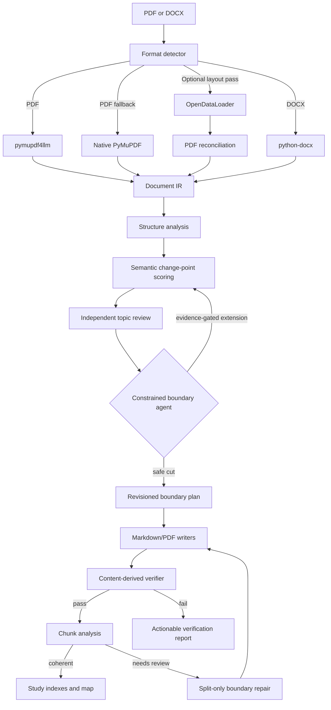

<div align="center">

# VeriChunk

**Verified semantic document chunking for AI agents.**

Turn long PDF and DOCX files into coherent, study-sized Markdown or PDF chunks—without cutting through paragraphs, lists, tables, or ideas.

[](https://github.com/alifazelidehkordi/ducsplit/actions/workflows/ci.yml)


[](LICENSE)

**CLI · MCP server · PDF · DOCX · Markdown · Verified PDF output**

</div>

---

VeriChunk combines deterministic document parsing with constrained AI judgment. The parser decides **where a cut is structurally safe**; an AI agent decides **where a cut is conceptually correct**; the verifier proves that the generated chunks preserve the source.

It is designed for textbooks, lecture notes, research material, technical manuals, and other long documents that need to fit into human or model-sized working sessions.

> **Project status:** Beta. The workflow and verification model are production-minded, but public interfaces may still evolve before 1.0.

## Contents

- [Why VeriChunk](#why-verichunk)
- [What makes it different](#what-makes-it-different)
- [Quick start](#quick-start)
- [MCP setup](#mcp-setup)
- [How it works](#how-it-works)
- [Verification guarantees](#verification-guarantees)
- [CLI reference](#cli-reference)
- [MCP tools](#mcp-tools)
- [Agent review backends](#agent-review-backends)
- [Configuration](#configuration)
- [Output structure](#output-structure)
- [Workflow safety](#workflow-safety)
- [Limitations](#limitations)
- [Troubleshooting](#troubleshooting)
- [Development](#development)
- [Name migration and compatibility](#name-migration-and-compatibility)
- [License](#license)

## Why VeriChunk

Long documents create three problems for AI-assisted reading and analysis:

1. **Context pressure** — entire books and manuals do not fit comfortably into a model context window.
2. **Bad boundaries** — page-based splitting cuts through arguments, tables, examples, and definitions.
3. **Silent corruption** — a generated chunk may omit, duplicate, reorder, or alter content without anyone noticing.

VeriChunk addresses all three. It creates bounded sessions around complete concepts, restricts agents to structurally valid cut points, and verifies the final output against a deterministic intermediate representation.

## What makes it different

| Typical splitter | VeriChunk |
|---|---|
| Cuts every *N* pages or tokens | Chooses among structurally safe, concept-aware boundaries |
| Lets an LLM invent arbitrary ranges | Constrains decisions to parser-generated element IDs |
| Trusts generated output | Reconstructs and verifies content, images, tables, and PDF pages |
| Produces anonymous numbered files | Supports agent-authored topics, study focus, and semantic filenames |
| Fails or degrades silently | Records parser fallbacks, skipped pages, and reconciliation notes |
| One-shot workflow | Supports review, repair, re-verification, and auditable session state |

### Core capabilities

- **Semantic-first splitting** — prefers 5–12 page sessions, allows page 13 for concept completion, and enforces an absolute 20-page cap.
- **Safe-cut constraints** — boundaries can occur only after complete headings, paragraphs, lists, tables, or images.
- **Heading-free topic detection** — scores semantic change points even when the source has weak structure.
- **Independent topic review** — transition, continuity, and adjudicator roles evaluate possible topic changes with evidence from both sides.
- **PDF and DOCX support** — structured extraction, native Word lists, tables, and embedded images.
- **Resilient PDF parsing** — `pymupdf4llm`, native PyMuPDF fallback, and optional OpenDataLoader reconciliation.
- **Markdown and PDF output** — generate AI-friendly text, page-faithful PDF chunks, or both.
- **Content-derived verification** — detects missing, duplicated, unknown, reordered, or altered source elements.
- **Boundary repair** — incoherent chunks can be split again without rewriting unaffected chunks.
- **CLI and MCP** — run directly or expose the workflow to Claude Code, Codex, Cursor-compatible hosts, Grok, OpenCode, and other MCP clients.
- **Bilingual study artifacts** — supports Persian and English topics, study focus, indexes, and a document-level study map.
- **Bounded execution** — external processes use timeouts, cancellation, output limits, and strict JSON handling.

## Quick start

### Requirements

| Dependency | Version | Needed for |
|---|---:|---|
| Python | 3.10+ | Core parser, workflow, writers, and CLI |
| Node.js | 18+ | MCP server |
| Java | 11+ | Recommended OpenDataLoader PDF reconciliation |
| AI agent | — | Conceptual boundary decisions and content analysis |

Java is recommended, not mandatory. If OpenDataLoader is unavailable, PDF parsing continues and records the fallback in the verification report.

### Install from source

```bash
git clone https://github.com/alifazelidehkordi/ducsplit.git verichunk
cd verichunk

python3 -m venv .venv
source .venv/bin/activate

pip install -e ".[dev,agents]"
npm ci
```

Confirm the installation:

```bash
verichunk --help
node --check server.js
java -version  # optional, but recommended for PDF reconciliation
```

The legacy `doc-splitter` command remains available during the name migration.

### Start a document session

```bash
verichunk run \
  --input ./book.pdf \
  --out ./output/book \
  --min-pages 5 \
  --max-pages 12
```

This writes the normalized document representation to `ir.json`, creates a revisioned `.split-session.json`, and returns the next required action.

A document starts in one of two states:

- `topic_review` when possible semantic transitions need independent review;
- `boundary` when the planner can immediately request a cut decision.

### Run topic-change reviews

Use an external JSON reviewer, OpenAI, Anthropic, or your MCP host's own subagents.

```bash
export OPENAI_API_KEY="..."
export DOC_SPLITTER_OPENAI_MODEL="your-review-model"

verichunk run-topic-reviews \
  --out ./output/book \
  --workers 6 \
  --backend openai
```

The `DOC_SPLITTER_*` environment variable prefix is retained for backward compatibility.

### Choose safe boundaries

Request the current decision window:

```bash
verichunk boundary-context --out ./output/book
```

The response includes source content and a list of allowed candidates. An agent selects one returned `element_id`:

```bash
verichunk commit-boundary \
  --out ./output/book \
  --action cut \
  --element-id el-042 \
  --reason "The current mechanism is complete; the next section introduces a different learning objective."
```

If the same concept continues from page 12 to page 13:

```bash
verichunk commit-boundary \
  --out ./output/book \
  --action extend \
  --allow-oversize \
  --reason "The concluding example on page 13 completes the same mechanism."
```

Extensions beyond page 13 require at least two independent reviewers and evidence element IDs. No extension can cross a confirmed topic change. At 20 pages, VeriChunk forces the best available safe boundary and records continuation metadata.

Repeat `boundary-context` and `commit-boundary` until the stage becomes `boundary_complete`.

### Write and verify chunks

```bash
verichunk write \
  --out ./output/book \
  --output-format both
```

`write` generates chunks, a manifest, and a verification report. It exits non-zero when integrity checks fail.

### Analyze, repair, and index

For each chunk:

```bash
verichunk analysis-context --out ./output/book --chunk-id 1

verichunk commit-analysis \
  --out ./output/book \
  --chunk-id 1 \
  --topic-fa "تنظیم گلوکز و پاسخ انسولین" \
  --topic-en "Glucose Regulation and Insulin Response" \
  --study-focus-fa "مسیرهای اصلی تنظیم قند خون، نقش انسولین و تفاوت پاسخ طبیعی و پاتولوژیک را مرور کنید." \
  --study-focus-en "Master the main glucose-control pathways, insulin's role, and the distinction between normal and pathological responses." \
  --coherence confident \
  --reason "The chunk presents one continuous regulatory mechanism."
```

A chunk marked `needs_review` enters the constrained repair flow:

```bash
verichunk repair-context --out ./output/book --chunk-id 4

verichunk repair-boundary \
  --out ./output/book \
  --chunk-id 4 \
  --cut-element-id el-118 \
  --reason "The diagnostic framework ends before treatment planning begins."
```

After every chunk has been read and analyzed:

```bash
verichunk index --out ./output/book

verichunk commit-index \
  --out ./output/book \
  --fa-file ./agent-written-study-index-fa.md \
  --en-file ./agent-written-study-index-en.md \
  --map-file ./agent-written-study-map.md
```

## MCP setup

Install the Node dependencies and register the server with available clients:

```bash
npm ci
./scripts/install-mcp.sh
```

Manual registration examples:

```bash
REPO=/absolute/path/to/verichunk

claude mcp add verichunk -s user -- \
  env DOC_SPLITTER_PYTHON="$REPO/.venv/bin/python3" \
  node "$REPO/server.js"

codex mcp add verichunk -- \
  env DOC_SPLITTER_PYTHON="$REPO/.venv/bin/python3" \
  node "$REPO/server.js"
```

Project-level configuration:

```json
{
  "mcpServers": {
    "verichunk": {
      "command": "node",
      "args": ["/absolute/path/to/verichunk/server.js"],
      "env": {
        "DOC_SPLITTER_PYTHON": "/absolute/path/to/verichunk/.venv/bin/python3",
        "DOC_SPLITTER_REVIEW_BACKEND": "openai",
        "DOC_SPLITTER_OPENAI_MODEL": "your-review-model",
        "OPENAI_API_KEY": "set-this-through-your-secret-manager"
      }
    }
  }
}
```

Suggested agent prompt:

> Use the VeriChunk MCP tools to split `book.pdf` into coherent Markdown chunks under `output/book`. Prefer 5–12 pages, allow page 13 only to finish the same concept, and never exceed 20 pages. Review possible topic changes, choose only returned safe candidates, write and verify the chunks, analyze every chunk in Persian and English, repair incoherent chunks, and author the final study indexes.

Provider keys are read from the MCP server environment. They are not accepted in tool inputs and are not written to session files or logs.

## How it works



The AI never edits parser state directly. It chooses from deterministic options and supplies an auditable rationale.

## Verification guarantees

VeriChunk verifies generated output against the parsed source rather than trusting filenames or manifest metadata.

### Markdown verification

- every expected IR element appears exactly once;
- no unknown element is introduced;
- element order is preserved;
- protected Markdown blocks reconstruct correctly;
- word counts remain within configured tolerance;
- expected table rows remain present;
- image references exist and extracted image hashes match.

### PDF verification

- every non-skipped source page is covered;
- page ranges match the manifest;
- output pages are visually compared with rendered source pages;
- overlap pages are accounted for explicitly;
- missing-text and skipped pages are reported.

### Workflow verification

- boundary plans cannot contain gaps or overlaps;
- confirmed topic changes cannot be crossed;
- unreviewed semantic transitions block planning;
- indexing is blocked until every chunk has committed analysis;
- agents must read every chunk before committing final indexes;
- generic auto-generated reasons and study-focus templates are rejected.

## CLI reference

The primary command is `verichunk`. `doc-splitter` remains a compatibility alias.

| Command | Purpose |
|---|---|
| `run` | Parse a document and start a revisioned split session. |
| `parse` | Parse only and write `ir.json`. |
| `topic-review-context` | Build evidence-backed topic-change review tasks. |
| `commit-topic-reviews` | Store independent topic-change votes. |
| `run-topic-reviews` | Run reviewer tasks through heuristic, command, OpenAI, or Anthropic backends. |
| `boundary-context` | Return the current content window and safe cut candidates. |
| `commit-boundary` | Commit a safe cut or an evidence-gated extension. |
| `write` | Write chunks and run verification. |
| `verify` | Re-run integrity checks against existing output. |
| `get-chunk` | Read one generated chunk. |
| `analysis-context` | Return full chunk content and analysis instructions. |
| `commit-analysis` | Store bilingual topic, study focus, and coherence. |
| `repair-context` | Return an incoherent chunk and safe internal repair candidates. |
| `repair-boundary` | Split a queued chunk and re-verify affected output. |
| `index` | Return verified context for final indexes and study map. |
| `commit-index` | Store agent-authored Persian, English, and map artifacts. |

### Common options

| Option | Default | Description |
|---|---:|---|
| `--out PATH` | `output` | Session, IR, chunk, report, and index directory. |
| `--min-pages N` | `5` | Preferred minimum; a confirmed topic change may cut earlier. |
| `--max-pages N` | `12` | Preferred maximum. |
| `--output-format markdown\|pdf\|both` | `markdown` | Output type; PDF output requires PDF input. |
| `--overlap-pages N` | `1` | Neighboring pages included around PDF boundaries. |
| `--reading-speed-wpm N` | `80` | Reading-time estimate used in indexes. |

Use `verichunk COMMAND --help` for command-specific options.

## MCP tools

| Tool | Mutates state? | Purpose |
|---|---:|---|
| `split_document` | yes | Parse input and create a split session. |
| `get_topic_change_review_batch` | no | Return independent semantic review tasks. |
| `run_parallel_topic_reviews` | yes | Execute and commit reviewer votes. |
| `commit_topic_change_reviews` | yes | Store host-supplied evidence-backed votes. |
| `get_boundary_context` | no | Return source context and safe candidates. |
| `commit_boundary` | yes | Commit a cut or one-page extension. |
| `write_chunks` | yes | Write Markdown/PDF chunks and verify them. |
| `verify_integrity` | no | Re-run verification. |
| `get_chunk` | no | Read one generated chunk. |
| `get_chunk_analysis_context` | no | Return full content for analysis. |
| `commit_chunk_analysis` | yes | Store bilingual analysis and coherence. |
| `get_boundary_repair_context` | no | Return safe internal repair points. |
| `repair_chunk_boundaries` | yes | Apply split-only repairs and verify again. |
| `get_study_index_context` | no | Return context for final index authoring. |
| `commit_study_index` | yes | Store final indexes and study map. |

When `output_dir` is omitted, the MCP server creates an isolated directory under `output-runs/`, preventing concurrent jobs from overwriting each other.

## Agent review backends

### MCP host subagents

Use `get_topic_change_review_batch`, distribute tasks to independent host agents, then submit the resulting votes with `commit_topic_change_reviews`.

### External command

The command must read one JSON task from stdin and write one JSON review object to stdout.

```bash
verichunk run-topic-reviews \
  --out ./output/book \
  --backend command \
  --agent-command ./scripts/my-json-reviewer \
  --workers 6
```

### OpenAI

```bash
pip install -e ".[openai]"
export OPENAI_API_KEY="..."
export DOC_SPLITTER_OPENAI_MODEL="your-review-model"
verichunk run-topic-reviews --out ./output/book --backend openai
```

### Anthropic

```bash
pip install -e ".[anthropic]"
export ANTHROPIC_API_KEY="..."
export DOC_SPLITTER_ANTHROPIC_MODEL="your-review-model"
verichunk run-topic-reviews --out ./output/book --backend anthropic
```

The heuristic backend exists for deterministic offline testing and baselines; it is not a substitute for independent semantic review.

## Configuration

### User-facing defaults

| Setting | Default | Notes |
|---|---:|---|
| Minimum pages | `5` | Soft target only. |
| Preferred maximum | `12` | Normal planning window. |
| Soft maximum | `13` | Allowed to finish the same concept with a specific reason. |
| Absolute maximum | `20` | Cannot be raised; forces a continuation split. |
| Words per page | `400` | Converts page targets to word-count windows. |
| PDF overlap pages | `1` | Reduces context loss at page-level PDF boundaries. |
| Study reading speed | `80 wpm` | Appropriate for dense technical or medical material. |
| Topic reviewers | `3` | Transition, continuity, and adjudicator roles. |
| Continuity reviewers | `2` | Minimum required beyond page 13. |
| OCR | disabled | Image-only pages are skipped and flagged. |

Internal defaults live in `src/doc_splitter/config.py`.

### MCP environment variables

| Variable | Purpose |
|---|---|
| `DOC_SPLITTER_PYTHON` | Python interpreter used by the MCP server. |
| `DOC_SPLITTER_REVIEW_BACKEND` | Default `command`, `openai`, or `anthropic` backend. |
| `DOC_SPLITTER_AGENT_COMMAND` | External JSON reviewer command. |
| `DOC_SPLITTER_OPENAI_MODEL` | OpenAI review model. |
| `DOC_SPLITTER_ANTHROPIC_MODEL` | Anthropic review model. |
| `DOC_SPLITTER_CLI_TIMEOUT_MS` | CLI subprocess timeout. |
| `DOC_SPLITTER_MAX_OUTPUT_BYTES` | Maximum captured process output. |
| `DOC_SPLITTER_RUNS_DIR` | Base directory for isolated MCP runs. |
| `DOC_SPLITTER_MCP_DEBUG` | Set to `1` for MCP debug logging. |

## Output structure

A typical Markdown run:

```text
output/book/
├── 01-introduction-to-glucose-regulation.md
├── 02-insulin-signaling-and-feedback.md
├── images/
├── ir.json
├── semantic-map.json
├── manifest.json
├── verification-report.json
├── semantic-review-report.json
├── study-index-fa.md
├── study-index-en.md
├── study-map.md
└── .split-session.json
```

| File | Purpose |
|---|---|
| `ir.json` | Ordered, normalized source elements. |
| `.split-session.json` | Revisioned workflow state, decisions, analyses, and failures. |
| `manifest.json` | Chunk ranges, filenames, element IDs, pages, and boundary reasons. |
| `verification-report.json` | Coverage, content, image, table, and PDF integrity results. |
| `semantic-review-report.json` | Coherence summary and repair queue. |
| `study-index-fa.md` | Persian session index. |
| `study-index-en.md` | English session index. |
| `study-map.md` | Topic map, dependencies, suggested study order, and session directory. |

PDF or `both` runs also include one `.pdf` file per chunk.

## Workflow safety

The enforced state machine is:

```text
topic_review → boundary → boundary_complete → writing → verification
             → content_analysis → index → complete
                                ↘ boundary_repair → writing → verification
```

Safety properties:

- state files are revisioned and written atomically under an advisory lock;
- stale concurrent writes fail with `SessionConflictError`;
- saved run settings persist across commands;
- only explicitly supplied CLI values override saved settings;
- `write` is blocked when reviews, boundaries, gaps, or overlaps are unresolved;
- repair can only split inside the queued chunk and cannot merge across established boundaries;
- unchanged chunks preserve their exact body and analysis during repair.

## Limitations

- **Scanned PDFs:** OCR is disabled by default; image-only pages are skipped and reported.
- **Password-protected PDFs:** not supported.
- **DOCX page numbers:** estimated from word count because DOCX has no stable rendered pagination.
- **PDF cut precision:** semantic decisions occur at element boundaries, but PDF output contains whole pages.
- **Very short documents:** may produce fewer or smaller chunks than the target range.
- **Very long concepts:** extensions after page 13 require evidence; page 20 is absolute.
- **Non-Latin filenames:** semantic filenames are ASCII-folded, with `section-N` as fallback.
- **Layout fidelity:** Markdown is best for semantic processing; PDF is best for preserving visual layout.

## Troubleshooting

| Problem | Likely cause | Fix |
|---|---|---|
| `Unsupported file format` | Input is not PDF or DOCX. | Convert the file or use a supported extension. |
| Password-protected PDF error | The source requires a password. | Save an unlocked copy and rerun. |
| Java/OpenDataLoader warning | Java 11+ is missing or the layout parser failed. | Install a JDK and confirm `java -version`; inspect reconciliation notes. |
| Missing elements during verification | Generated blocks, order, or manifest ranges differ from the IR. | Regenerate with `write`; do not hand-edit protected source blocks. |
| Image/hash/page mismatch | Generated assets changed after writing. | Restore or regenerate the named chunk and inspect the report. |
| PDF output rejected for DOCX | PDF chunks require PDF source pages. | Use `--output-format markdown`. |
| Missing content analyses | Not every chunk has committed analysis. | Run `analysis-context` and `commit-analysis` for each chunk. |
| Chunk files not read | The agent tried to index unread chunks. | Call `analysis-context` or `get-chunk` for every listed chunk. |
| Conceptual reason rejected | The reason is generic or auto-generated. | Explain what ends, what begins, and why the boundary is coherent. |
| MCP cannot import the package | MCP is using the wrong Python interpreter. | Point `DOC_SPLITTER_PYTHON` to the project virtual environment. |
| Temporary-file error | No writable temporary directory exists. | Set `TMPDIR` to a writable location. |

## Development

### Repository layout

```text
verichunk/
├── server.js                         # MCP server
├── mcp/                              # Node process and argument helpers
├── pyproject.toml                    # Python packaging and CLI entry points
├── package.json                      # MCP dependencies
├── scripts/install-mcp.sh            # MCP registration helper
├── src/doc_splitter/
│   ├── cli.py                        # CLI entry point
│   ├── orchestrator.py               # Pipeline coordination
│   ├── config.py                     # Workflow defaults
│   ├── format_detector.py            # Input detection
│   ├── ir/                           # Intermediate representation
│   ├── parsers/                      # PDF/DOCX parsing and reconciliation
│   ├── semantic.py                   # Semantic change-point scoring
│   ├── agents/                       # Reviewer backends and scheduler
│   ├── boundary/                     # Safe candidates and session planning
│   ├── writers/                      # Markdown and PDF writers
│   ├── content/                      # Analysis and repair workflow
│   ├── markdown_codec.py             # Canonical protected rendering
│   ├── verifier.py                   # Content-derived integrity checks
│   └── index_generator.py            # Index context and commit logic
└── tests/
```

### Run all checks

```bash
uv sync --frozen --extra dev --extra agents
uv run ruff check .
uv run ruff format --check .
uv run mypy src/doc_splitter
uv run pytest -q

npm ci
npm test
node --check server.js

uv build
```

Run the frozen golden-corpus audit:

```bash
PYTHONPATH=src python3 scripts/audit-golden-corpus.py \
  --output docs/baseline/golden-results.json
```

Run the MCP server directly:

```bash
node server.js
```

It will wait for JSON-RPC messages over stdio.

## Name migration and compatibility

The project was originally published as `ducsplit` with the CLI and Python distribution named `doc-splitter`.

The new public brand is **VeriChunk**. The migration is intentionally non-breaking:

| Interface | Preferred | Compatibility status |
|---|---|---|
| Project/repository name | `verichunk` | Rename the GitHub repository after merging this change. |
| CLI | `verichunk` | `doc-splitter` remains available. |
| MCP server registration | `verichunk` | Existing `doc-splitter` registrations can continue to work. |
| Python distribution | `doc-splitter` | Retained in the 0.5 series to avoid lockfile and package breakage. |
| Python import | `doc_splitter` | Retained to avoid breaking integrations. |
| Environment variables | `DOC_SPLITTER_*` | Retained for backward compatibility. |

A future major release can deprecate legacy identifiers through a documented migration rather than an abrupt rename.

## Design principles

- **Constrain model judgment.** Agents choose among safe options; they do not invent parser state.
- **Make every decision auditable.** Boundaries, evidence, reviewers, reasons, and revisions are persisted.
- **Verify content, not metadata.** Output is reconstructed and compared with source-derived elements.
- **Prefer concepts over page counts.** Size targets guide the process but do not override confirmed topic changes.
- **Fail loudly and specifically.** Parser fallbacks, skipped content, conflicts, and integrity errors are reported.
- **Preserve unaffected work.** Repair rewrites only changed ranges and retains exact unchanged chunks.
- **Keep model providers optional.** Use host agents, external commands, OpenAI, Anthropic, or deterministic test backends.

## License

MIT. See [`LICENSE`](LICENSE).
