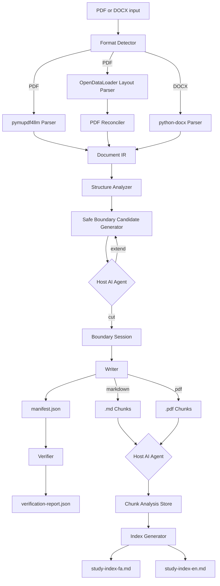

# ducsplit

**Conceptual document splitter for verified, study-sized chunks — CLI and MCP.**

`ducsplit` splits large PDF and DOCX documents into study-sized **conceptual** chunks, not blind page ranges. It is built for developers using AI coding assistants (Claude Code, Codex, Cursor, Grok, OpenCode, or any MCP-capable host) who need to break textbooks, lecture notes, and manuals into sessions an agent can actually work with.

Repository: [github.com/alifazelidehkordi/ducsplit](https://github.com/alifazelidehkordi/ducsplit)

## Table of Contents

- [Why This Exists](#why-this-exists)
- [Key Features](#key-features)
- [Architecture](#architecture)
- [Requirements](#requirements)
- [Installation](#installation)
- [Quick Start: CLI](#quick-start-cli)
- [Quick Start: MCP](#quick-start-mcp)
- [CLI Reference](#cli-reference)
- [MCP Tools](#mcp-tools)
- [Configuration](#configuration)
- [Output Structure](#output-structure)
- [Host-Agent Workflow](#host-agent-workflow)
- [Output Format Trade-Offs](#output-format-trade-offs)
- [Edge Cases and Limitations](#edge-cases-and-limitations)
- [Troubleshooting](#troubleshooting)
- [Development](#development)
- [Design Principles](#design-principles)
- [License](#license)

## Why This Exists

Long study documents overwhelm AI assistants: they exceed context windows, trigger lost-in-the-middle failures, and waste tokens. Simple page slicing makes it worse — it cuts through arguments, divorces tables from their explanations, and ignores how the author actually structured the material.

`ducsplit` combines deterministic document parsing with host-agent reasoning:

- The tool extracts structured elements from PDF or DOCX into a shared intermediate representation (IR).
- It proposes **structurally safe** boundary candidates — only after complete paragraphs, headings, lists, or tables.
- Your host AI agent reads the surrounding content and chooses the best **conceptual** cut (or extends the window if the topic continues).
- Output is verified for missing, duplicated, or mismatched content.
- Each chunk can be analyzed into bilingual Persian/English study metadata.
- Final study indexes link to every session and include a practical **Study Focus** column.

`ducsplit` does not bundle its own LLM. The host agent supplies judgment; `ducsplit` supplies parsing, constraints, persistence, writing, and verification.

## Key Features

- **Conceptual splitting** — targets 5–10 page study sessions, but lets concept completeness override page count.
- **Safe-cut constraints** — the LLM can only choose from deterministic candidates, preventing mid-paragraph, mid-list, and mid-table cuts.
- **Dual PDF parsing** — `pymupdf4llm` for Markdown-like extraction plus OpenDataLoader for layout reconciliation when Java is available.
- **DOCX support** — headings, paragraphs, lists, tables, and embedded images via `python-docx`.
- **CLI and MCP** — use `doc-splitter` directly or expose it as an MCP server to AI coding assistants.
- **Verified output** — checks element coverage, duplicates, word-count drift, table rows, image references, and PDF page coverage.
- **Markdown and PDF chunks** — write semantic Markdown chunks, extracted PDF chunks, or both.
- **Boundary overlap for PDFs** — includes adjacent boundary pages to reduce loss when conceptual cuts occur mid-page.
- **Agent-authored bilingual study indexes** — provides verified context for the host agent to write `study-index-fa.md` and `study-index-en.md` with session links, study focus, page ranges, and estimated reading time.
- **Agent-decision enforcement** — rejects auto-generated reasons (`auto-cut`, `auto from section_headings`), template study-focus, and index commits without reading every chunk file.
- **Realistic study-time estimates** — defaults to 80 words per minute (study speed) rather than casual reading speed (200 wpm) for technical/medical content.

## Architecture



## Requirements

| Dependency | Version | Purpose |
|---|---|---|
| Python | 3.10+ | Core pipeline and CLI |
| Java | 11+ | OpenDataLoader PDF layout reconciliation (recommended) |
| Node.js | 18+ | MCP server only |
| Host AI agent | — | Boundary decisions and chunk content analysis |

Java is recommended for better PDF reconciliation. Parsing falls back to `pymupdf4llm` alone if OpenDataLoader cannot run.

## Installation

```bash
git clone https://github.com/alifazelidehkordi/ducsplit.git
cd ducsplit

python3 -m venv .venv
source .venv/bin/activate

pip install -e ".[dev]"
npm install

java -version   # must succeed for full PDF reconciliation
```

The Python package exposes the CLI:

```bash
doc-splitter --help
```

If the command is not on your shell path:

```bash
python -m doc_splitter.cli --help
```

## Quick Start: CLI

Start a split session:

```bash
doc-splitter run \
  --input ./book.pdf \
  --out ./output/book \
  --min-pages 5 \
  --max-pages 10
```

This parses the document, writes `ir.json`, creates `.split-session.json`, and prints the first boundary decision context.

Repeat the boundary loop until the context reports `status: "complete"`:

```bash
doc-splitter boundary-context --out ./output/book
```

Ask your host agent to read the JSON, choose one safe candidate, and return either:

```json
{
  "action": "cut",
  "element_id": "el-042",
  "reason": "The current explanation ends here; the next section starts a different topic."
}
```

Commit the decision:

```bash
doc-splitter commit-boundary \
  --out ./output/book \
  --action cut \
  --element-id el-042 \
  --reason "The current explanation ends here; the next section starts a different topic."
```

If the concept continues beyond the current window:

```bash
doc-splitter commit-boundary \
  --out ./output/book \
  --action extend \
  --reason "The same mechanism continues into the next example."
```

After boundaries are complete, write and verify chunks:

```bash
doc-splitter write --out ./output/book
```

Analyze each chunk:

```bash
doc-splitter analysis-context --out ./output/book --chunk-id 1
```

Commit the host agent's bilingual analysis:

```bash
doc-splitter commit-analysis \
  --out ./output/book \
  --chunk-id 1 \
  --topic-fa "تنظیم گلوکز و پاسخ انسولین" \
  --topic-en "Glucose Regulation and Insulin Response" \
  --study-focus-fa "مسیرهای اصلی تنظیم قند خون، نقش انسولین و تفاوت پاسخ طبیعی و پاتولوژیک را مرور کنید." \
  --study-focus-en "Review the main glucose-control pathways, insulin's role, and how normal and pathological responses differ." \
  --coherence confident \
  --reason "The chunk covers one continuous regulatory mechanism."
```

Ask the host agent to write the final indexes after every chunk has analysis:

```bash
doc-splitter index --out ./output/book
doc-splitter commit-index \
  --out ./output/book \
  --fa-file ./agent-written-study-index-fa.md \
  --en-file ./agent-written-study-index-en.md
```

### PDF-native chunks

```bash
doc-splitter run \
  --input ./book.pdf \
  --out ./output/book-pdf \
  --output-format pdf \
  --overlap-pages 1
```

## Quick Start: MCP

After `npm install`, register the MCP server with your host CLI (replace the path if you cloned elsewhere):

```bash
REPO=/absolute/path/to/ducsplit

claude mcp add doc-splitter -s user -- node "$REPO/server.js"
codex mcp add doc-splitter -- node "$REPO/server.js"
grok mcp add doc-splitter -s user -- node "$REPO/server.js"
opencode mcp add doc-splitter -- node "$REPO/server.js"
```

Or use the helper script:

```bash
./scripts/install-mcp.sh
```

For project-level MCP configuration, use `.mcp.json`:

```json
{
  "mcpServers": {
    "doc-splitter": {
      "command": "node",
      "args": ["/absolute/path/to/ducsplit/server.js"],
      "env": {
        "DOC_SPLITTER_PYTHON": "/absolute/path/to/ducsplit/.venv/bin/python3"
      }
    }
  }
}
```

Then ask your agent:

> Use the `doc-splitter` MCP tools to split `book.pdf` into 5–10 page conceptual Markdown chunks under `output/book`. Choose only safe boundary candidates, write the chunks, verify integrity, analyze every chunk in Persian and English, then author and commit the study indexes.

## CLI Reference

### Commands

| Command | Purpose |
|---|---|
| `doc-splitter run` | Parse a document and start a boundary session. |
| `doc-splitter parse` | Parse only and write `ir.json`; useful for debugging parser output. |
| `doc-splitter boundary-context` | Print the current content window, instructions, and safe cut candidates. |
| `doc-splitter commit-boundary` | Commit a `cut` or `extend` decision. |
| `doc-splitter write` | Write chunks and run verification. |
| `doc-splitter verify` | Re-run verification against existing chunks and manifest. |
| `doc-splitter get-chunk` | Read one chunk's content by numeric ID. |
| `doc-splitter analysis-context` | Print full chunk content and analysis instructions. |
| `doc-splitter commit-analysis` | Store bilingual topic, study focus, coherence, and reason for one chunk. |
| `doc-splitter index` | Return context for agent-authored `study-index-fa.md` and `study-index-en.md`. |
| `doc-splitter commit-index` | Store final Persian and English indexes written by the host agent. |

### Common Options

Available on `run`, `parse`, `boundary-context`, `commit-boundary`, `write`, `verify`, and `index` unless noted.

| Option | Default | Description |
|---|---:|---|
| `--out PATH` | `output` | Output/session directory. |
| `--min-pages N` | `5` | Target minimum chunk size (converted to words via `words_per_page`). |
| `--max-pages N` | `10` | Target maximum chunk size; guidance for the host agent. |
| `--reading-speed-wpm N` | `80` | Study reading-speed estimate (wpm) for index time calculations. Use 80–100 for technical/medical content, 150–200 for general reading. |
| `--output-format markdown\|pdf\|both` | `markdown` | Chunk output format. PDF output requires PDF input. |
| `--overlap-pages N` | `1` | Extra neighboring pages around PDF boundary pages. |

### `run`

```bash
doc-splitter run --input ./book.pdf --out ./output/book
```

Required: `--input PATH` (source `.pdf` or `.docx`).

### `parse`

```bash
doc-splitter parse --input ./book.docx --out ./output/debug
```

Writes `ir.json` without starting a boundary workflow.

### `boundary-context`

Returns JSON with `status`, `chunk_number`, `content_window`, `safe_candidates`, `instructions`, `min_pages`, and `max_pages`. The host agent must choose only from `safe_candidates`.

### `commit-boundary`

| Option | Required | Description |
|---|---:|---|
| `--action cut\|extend` | yes | `cut` commits a boundary; `extend` expands the decision window. |
| `--element-id ID` | for `cut` | Safe candidate element ID. |
| `--reason TEXT` | no | Human-readable rationale stored for auditability. |

### `write` / `verify`

`write` writes chunk files, `manifest.json`, and `verification-report.json`. Exits non-zero if verification fails.

`verify` checks:

- every expected IR element appears exactly once
- no unknown elements are present
- chunk word counts match the source within tolerance
- Markdown tables preserve expected rows
- Markdown image references are present
- PDF outputs cover all non-skipped source pages

### `commit-analysis`

`coherence` must be `confident` or `needs_review`. When all chunks have analysis, `semantic-review-report.json` is written.

### `index`

Requires every chunk to have committed content analysis, including both study-focus fields. Returns verified chunk metadata and instructions for the host agent. It does not write the index prose.

### `commit-index`

Stores the final `study-index-fa.md` and `study-index-en.md` bodies authored by the host agent. The command validates that every chunk file is referenced.

## MCP Tools

| Tool | Inputs | Mutates? | Description |
|---|---|---:|---|
| `split_document` | `file_path`, optional `min_pages`, `max_pages`, `output_dir`, `output_format`, `overlap_pages` | yes | Parses a PDF/DOCX and starts the boundary session. |
| `get_boundary_context` | optional `output_dir` | no | Returns the current content window and safe cut candidates. |
| `commit_boundary` | `action`, optional `element_id`, `reason`, `output_dir` | yes | Commits a boundary cut or extends the window. |
| `write_chunks` | optional `output_dir` | yes | Writes chunk files and runs verification. |
| `get_chunk` | `chunk_id`, optional `output_dir` | no | Reads generated chunk content. |
| `verify_integrity` | optional `output_dir` | no | Re-runs verification. |
| `get_chunk_analysis_context` | `chunk_id`, optional `output_dir` | no | Returns full chunk content for analysis. |
| `commit_chunk_analysis` | `chunk_id`, `topic_fa`, `topic_en`, `study_focus_fa`, `study_focus_en`, `coherence`, optional `reason`, `output_dir` | yes | Stores bilingual chunk analysis. |
| `get_study_index_context` | optional `output_dir`, `reading_speed_wpm` | no | Returns context for agent-authored Persian and English study indexes. |
| `commit_study_index` | `index_fa`, `index_en`, optional `output_dir` | yes | Stores final Persian and English study indexes written by the host agent. |

The MCP server is a thin Node.js wrapper around the Python CLI. It uses `DOC_SPLITTER_PYTHON` when set; otherwise it runs `python3`.

## Configuration

### CLI / MCP Options

| Setting | CLI Option | Default | Notes |
|---|---|---:|---|
| Output directory | `--out` | `output` | Session state, IR, chunks, reports, indexes. |
| Minimum pages | `--min-pages` | `5` | Filters early safe candidates. |
| Maximum pages | `--max-pages` | `10` | Target guidance for the host agent. |
| Output format | `--output-format` | `markdown` | `markdown`, `pdf`, or `both`. |
| Boundary overlap | `--overlap-pages` | `1` | PDF outputs only. |
| Reading speed | `--reading-speed-wpm` | `80` | Index time estimates; 80 wpm for technical/medical study, 150+ for general content. |

### Internal Defaults

Defined in `src/doc_splitter/config.py`. Not all have CLI flags yet.

| Setting | Default | Purpose |
|---|---:|---|
| `boundary_window_pages` | `15` | Initial content window shown to the host agent. |
| `boundary_window_extension_pages` | `10` | Pages added when the host chooses `extend`. |
| `words_per_page` | `400` | Converts page targets into word-count windows. |
| `image_extraction` | `true` | Extracts and preserves image references. |
| `ocr_enabled` | `false` | Scanned pages may be skipped. |
| `on_missing_text_page` | `skip_and_flag` | Missing-text pages recorded in verification output. |
| `word_count_tolerance_pct` | `0.005` | Allows small word-count drift during verification. |
| `word_count_tolerance_min` | `10` | Minimum word-count tolerance. |
| `min_chunks_per_chapter` | `2` | Minimum chunks for chapter grouping in indexes. |
| `slug_max_length` | `60` | Maximum semantic filename slug length. |

## Output Structure

A typical Markdown run:

```text
output/book/
├── 01_intro-to-glucose-regulation.md
├── 02-insulin-signaling-and-feedback.md
├── images/
├── ir.json
├── manifest.json
├── verification-report.json
├── semantic-review-report.json
├── study-index-fa.md
├── study-index-en.md
└── .split-session.json
```

A PDF or `both` run may also include `.pdf` files per chunk.

### Important Files

| File | Description |
|---|---|
| `ir.json` | Parsed document intermediate representation. |
| `.split-session.json` | Boundary decisions, stage, config snapshot, chunk analyses. |
| `manifest.json` | Chunk list, filenames, page ranges, element IDs, boundary reasons. |
| `verification-report.json` | Integrity report: coverage, word-count checks, skipped pages, reconciliation notes. |
| `semantic-review-report.json` | Summary of chunk analyses and any `needs_review` chunks. |
| `study-index-fa.md` | Persian study index (Overview, chapter table, Study Focus per session). |
| `study-index-en.md` | English study index. |
| `images/` | Extracted image assets referenced by Markdown chunks. |

### Study Index Structure

Each agent-authored `study-index-*.md` should include:

1. **Overview** — session count, PDF page coverage, total study time
2. **Session table** — topic links, page ranges, estimated time, and **Study Focus**
3. **Optional grouping** — chapters or sections only when they naturally fit the document
4. **Document-specific study guidance** — only when useful for that source

## Host-Agent Workflow

### Boundary Loop

1. `ducsplit` parses the document into ordered elements.
2. It computes a window starting at the current cursor.
3. It finds safe cut candidates after complete headings, paragraphs, lists, or tables.
4. The host agent reads the content window and candidate list.
5. The host agent chooses `cut` with an allowed `element_id`, or `extend` if the concept is incomplete.
6. `ducsplit` validates the decision and moves the cursor.
7. The loop continues until the document is fully covered.

Example context returned to the host agent:

```json
{
  "status": "needs_agent_decision",
  "chunk_number": 4,
  "content_window": "...",
  "safe_candidates": [
    {
      "element_id": "el-042",
      "after_type": "paragraph",
      "snippet": "This completes the comparison of...",
      "cumulative_word_count": 9850
    }
  ],
  "min_pages": 5,
  "max_pages": 10
}
```

The LLM must not invent boundaries. Committing an `element_id` not in `safe_candidates` fails.

### Analysis Loop

1. `analysis-context` returns full chunk content and neighboring titles.
2. The host agent writes a concise bilingual topic and practical study focus. `topic_en` becomes the final chunk filename slug.
3. `commit-analysis` stores the result in `.split-session.json`, renames the chunk from the agent-selected topic, and updates `manifest.json`.
4. Chunks marked `needs_review` appear in `semantic-review-report.json` and block final index commit until the boundary/coherence issue is resolved.
5. **Every `get_chunk` call is tracked.** The agent must read all chunk files before `commit-index` is accepted.
6. `index` returns context for the final index-writing pass, including `chunks_unread` so the agent knows which files remain.
7. The host agent writes both complete Markdown indexes and stores them with `commit-index`.

The study focus should answer: **What should the learner master in this session?**

Good:

```json
{
  "topic_en": "Insulin Signaling and Glucose Uptake",
  "study_focus_en": "Master the insulin receptor cascade, GLUT4 translocation, and how defects in the pathway explain insulin resistance."
}
```

Weak:

```json
{
  "topic_en": "Insulin",
  "study_focus_en": "This section is about insulin."
}
```

## Output Format Trade-Offs

| Format | Best For | Trade-Offs |
|---|---|---|
| `markdown` | AI reading, search, notes | Loses exact PDF visual layout. |
| `pdf` | Preserving original page appearance | Boundaries are page-extracted; mid-page cuts need overlap. |
| `both` | Text plus original page fidelity | More disk space; may duplicate boundary pages. |

For PDF output, conceptual chunks are decided by element boundaries, but written PDFs include whole pages. `--overlap-pages` reduces context loss at boundaries at the cost of duplicated pages between neighbors.

## Edge Cases and Limitations

- **Scanned PDFs** — OCR is disabled by default. Pages without extractable text are skipped and reported.
- **Password-protected PDFs** — not supported.
- **DOCX page numbers** — estimated from word count; DOCX has no stable rendered page numbers.
- **Non-Latin filenames** — semantic slugs are ASCII-folded; fallback is `section-N`.
- **Very short documents** — may produce fewer or smaller chunks than the 5–10 page target.
- **Very long concepts** — the host agent should choose `extend` until a coherent cut appears.
- **Tables and lists** — treated atomically; the tool avoids cutting through them.
- **OpenDataLoader failures** — parsing continues with `pymupdf4llm`; recorded in reconciliation notes.
- **PDF boundary precision** — PDF chunks are page-level extracts, not element-level visual crops.

## Troubleshooting

| Problem | Likely Cause | Fix |
|---|---|---|
| `Unsupported file format` | Input is not `.pdf` or `.docx`. | Convert or use a supported extension. |
| `Password-protected PDFs are not supported` | PDF requires a password. | Save an unlocked copy and rerun. |
| `Java 11+ is required for OpenDataLoader` | Java missing or not on `PATH`. | Install a JDK; confirm `java -version`. |
| `OpenDataLoader skipped` in report | OpenDataLoader failed; fallback succeeded. | Review reconciliation notes; fix Java if layout fidelity matters. |
| Verification fails (missing elements) | Chunks or manifest inconsistent. | Re-run `write`; inspect `verification-report.json`. |
| Verification fails (word-count mismatch) | Parser and written chunks diverged. | Inspect Markdown around tables/images; file an issue with sample input. |
| `PDF output is only supported for PDF inputs` | `--output-format pdf` or `both` with DOCX. | Use `--output-format markdown` for DOCX. |
| `Missing content analyses` during `index` | Not every chunk has committed analysis. | Run `analysis-context` and `commit-analysis` for each chunk. |
| `Chunk files not yet read by the agent` during `commit-index` | Index committed without reading all chunk files via `get_chunk`. | Call `get_chunk` for every unread chunk ID listed in the error; the CLI tracks reads automatically. |
| `Boundary reason must be a conceptual decision` | Reason contains `auto-cut` or similar auto-generated pattern. | Write a real conceptual reason explaining where the topic ends and why. |
| `auto from section_headings is not acceptable` | Analysis reason is auto-generated. | Read the chunk and provide your own coherence assessment. |
| `auto-generated study-focus template` in index | Index contains template like `Study X: core definitions, mechanisms`. | Write unique educational study focus for each session. |
| MCP server cannot import Python package | Wrong Python interpreter. | Set `DOC_SPLITTER_PYTHON` to the venv Python path. |
| Temporary-file errors | No writable temp directory. | Set `TMPDIR` to a writable directory. |

## Development

```text
ducsplit/
├── server.js                         # MCP server
├── pyproject.toml                    # Python package metadata
├── package.json                      # Node/MCP dependencies
├── scripts/install-mcp.sh            # MCP registration helper
├── src/doc_splitter/
│   ├── cli.py                        # CLI entry point
│   ├── orchestrator.py               # Pipeline coordination
│   ├── config.py                     # SplitConfig defaults
│   ├── format_detector.py            # PDF/DOCX detection
│   ├── ir/                           # Intermediate representation
│   ├── parsers/                      # PDF/DOCX parsers and reconciliation
│   ├── boundary/                     # Safe candidates and boundary session
│   ├── writers/                      # Markdown and PDF writers
│   ├── content/                      # Chunk analysis workflow
│   ├── verifier.py                   # Integrity verification
│   └── index_generator.py            # Agent-authored index context/commit
└── tests/
```

Run tests:

```bash
source .venv/bin/activate
python -m pytest -q
```

Run the MCP server directly (waits for stdio MCP protocol messages):

```bash
node server.js
```

Recommended workflow:

1. Add or update parser/writer behavior.
2. Add focused tests under `tests/`.
3. Run `python -m pytest -q`.
4. Test a small real PDF or DOCX through the CLI.
5. Inspect `ir.json`, `manifest.json`, and `verification-report.json`.
6. If MCP behavior changed, test through an MCP host with `DOC_SPLITTER_PYTHON` pointing at the local venv.

## Design Principles

- **LLM judgment is constrained** — the agent decides among safe options; it does not rewrite parser state freely.
- **Agent laziness is rejected** — auto-generated reasons (`auto-cut`, `auto from section_headings`), template study-focus, and index commits without reading chunk files are caught by validators and refused.
- **Verification is mandatory** — generated chunks are auditable and checked for loss or duplication.
- **Concepts beat page counts** — 5–10 pages is a target, not a hard rule.
- **No bundled LLM** — `ducsplit` does not call an external LLM API; the host agent does.
- **PDF fidelity and semantic precision differ** — Markdown is best for semantic processing; PDF output is best for visual study continuity.

## License

No license file is currently included. Until one is added, the repository is public but not explicitly open-source licensed. Recommended next step: add an OSI-approved license (MIT or Apache-2.0).
